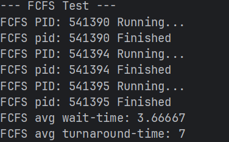
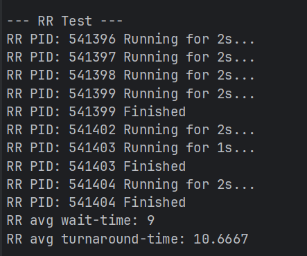
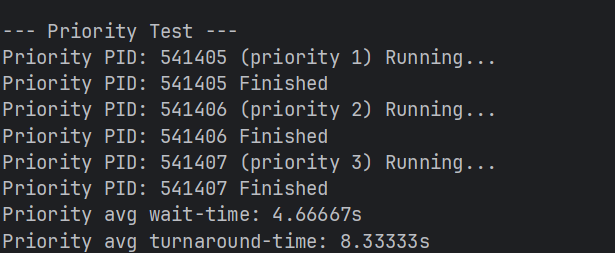
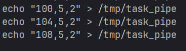
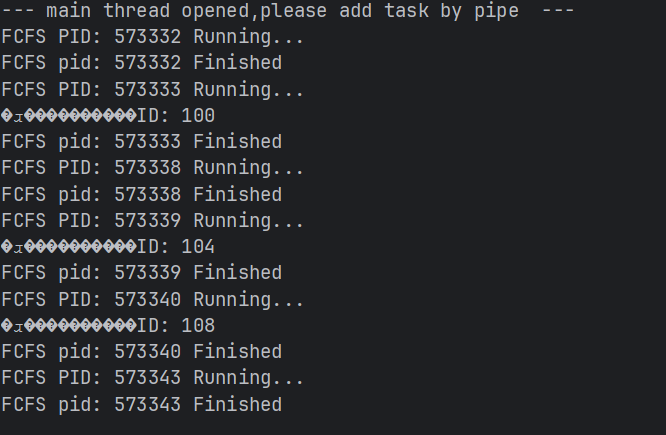

# 选题三：多进程任务模拟器

## 运行方法

```shell
git clone https://github.com/renxingdawang/Multi-process-task-scheduler.git
```

进入项目根目录

```shell
./build.sh
```

编译完成后，

```
cd build
./ProcessScheduler
```

在控制台打印--- main thread opened,please add task by pipe ---之后

使用echo "100,5,2" > /tmp/task_pipe加入新task。

## 效果图

### FSFC



### RR



### Priority



### Pipe_Add_task



